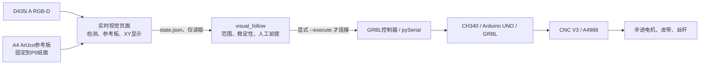

# DayuWriter 项目全流程记录

## 1. 项目目标和记录规则

项目从一台已组装的开源 CoreXY 写字机开始，目标顺序是：恢复安全运动、用 Python 控制、接入 D435i A、把纸面目标转换为写字机坐标，并验证有界动作。远期目标是把该结构改造成滑台式视觉作业平台；本记录不将远期目标写成已完成事实。

下文中“已验证”必须同时有现场观察、原始设备输出、程序记录或测试之一；“实现”表示代码存在且离线验证；“未完成”表示没有足够的现场证据，不能由演示画面替代。

## 2. 系统组成



关键隔离：浏览器页面没有串口、G-code 或电机控制能力；视觉跟随程序默认预览，只有带有显式执行参数和现场确认时才打开 COM 口。

## 3. 阶段一：恢复写字机硬件和 GRBL

### 3.1 历史信息先作为线索，而非事实

旧对话曾提到 `COM11`、GRBL 1.1h 等信息。实际以 Windows 枚举和 GRBL 启动信息复核，确认设备是 `USB-SERIAL CH340`，实际固件记录为 `Grbl 1.1f kvenjoy.com.20170131`。串口号曾因 USB 变化由 `COM3` 变为 `COM4`；它是 Windows 地址，不是写字机的固定身份。

### 3.2 找到“有 ok 但电机不动”的根因

早期软件能够收到 GRBL 的 `ok` 与状态帧，而电机不运动。经现场接线复查，原因是 12 V 电机电源必须接在红色 CNC V3 的 `12-36V` 端子；Arduino UNO 的圆形电源孔不能给电机驱动器供电。压紧 CNC V3 端子后，电机恢复声音和真实动作。

这一过程确认了完整因果链：

```text
Python -> pySerial -> CH340 USB-UART -> Arduino/GRBL
       -> STEP/DIR -> A4988 -> 电机 -> 皮带/丝杆/笔架
```

`ok` 只表示 GRBL 接受一行文本。一次动作完成还需最终 `Idle`，并由人眼确认机械实际按正确方向位移。

### 3.3 机械基础验证

X、Y、Z 三轴都完成了小幅实机运动和距离检查；20 mm 的 X/Y 指令与实测约一致，Z 总计 10 mm 下移与实测约一致。建立人工 P0 后，确认 X+ 向右、Y+ 向前、Z+ 向下。P0 是人工物理标记，非自动回零或编码器读数。

## 4. 阶段二：建立 Python 控制与现场可视化

### 4.1 可审查的控制层

控制代码按职责拆分：

| 模块 | 责任 |
| --- | --- |
| `grbl_protocol.py` | 校验和编码 `$J=G91 G21 ...` 相对 Jog 命令 |
| `grbl_controller.py` | 保持串口会话、超时、状态读取、等待最终 `Idle` |
| `workspace.py` | 解析 MPos、P0-XY 工作范围、长移动分段 |
| `grbl_console.py` | `status`、`where`、`jog`、`goto` 等交互命令 |
| `grbl_monitor.py` | Tkinter 现场界面，显示真实 CALL/TX/RX/MPos，而非伪造日志 |

所有长距离相对移动按不大于 5 mm 的段执行。一个持久串口连接避免每条指令重复打开端口而使坐标解释混乱，但它仍无法抵消断电、手推或丢步导致的物理位置失真。

### 4.2 现场基线

在人工 P0 及当时机械余量下，软件 XY 范围记录为 X `[-190,190] mm`、Y `[-90,140] mm`；Z 没有可靠的软件边界。基础往返 `(0,0) -> (10,10) -> (0,0)` 已有实机观察记录。`Pn:P` 探针输入有效状态持续出现，原因未最终排除；因此未把探针和 Z 自动接触纳入自动化。

### 4.3 新电脑与演示支持

建立了 Conda 环境 `dayuwriter-control`（Python 3.11、pyserial、pytest，后续加入 NumPy、pyrealsense2、OpenCV contrib）。`grbl_monitor` 可用 `--port DEMO` 打开离线教学界面；它不会伪造串口数据，也不会因为窗口打开就发送动作。

## 5. 阶段三：接入 D435i A

### 5.1 相机身份和只读采集

选定完整 D435i A，而不是裸 D430 或不同生态的深度模组。设备已枚举为：

```text
型号: Intel RealSense D435I
序列号: 231122070403
固件: 5.13.0.55（当时 Viewer 记录）
USB: 3.2
```

先在 RealSense Viewer 验证 RGB、Stereo/Depth 和 USB 3.x，再关闭 Viewer，使用 Python `camera_probe` 做只读 RGB-D 采集。出现过 `Frame didn't arrive within 5000`、深度值为零、文件被占用等问题；其中相机被 Viewer/旧进程占用、启动未稳定和临时文件被打开是优先排查项。恢复方式是关闭独占程序、直接 USB 3.x 连接、重插相机并重新启动单一采集进程，而不是把空深度当成真实空间坐标。

### 5.2 从固定姿态拟合到可恢复参考板

先做手工选点的有限区域平面映射，再用保留点检验。一个 28.053 mm 误差的结果和一个发生约 75 px 漂移的结果均被淘汰。v3 的 `0-30 mm` 区域在两个保留点上达到平均 0.691 mm、最大 0.896 mm，但只适用于当时固定姿态。

随后制作 A4 六 ArUco 标记参考板，使相机重新安装后可由参考板恢复纸面几何。通过 100 mm 实尺、机械 P0/X30/Y30 对齐、六 ID 完整可见和保留标记误差门槛，才允许页面显示纸面坐标。详见 [19-标定过程与经验](19-calibration-process-and-lessons.md)。

## 6. 阶段四：红色方块实时显示和受监督运动

### 6.1 实时显示

`live_red_target_dashboard` 在 `http://127.0.0.1:8765/` 显示 RGB、目标框、目标中心、相机坐标、纸面 P0-XY、参考板状态和错误原因。它会拒绝 A4 参考区域外的红色候选，避免把笔架、桌面或其他红物体投影为纸面目标。

在一次固定会话中，六标记保留验证为平均 1.472 mm、最大 2.175 mm；P0 红方块显示约 `(2.03,0.08) mm`。这已足以作为“在当前误差量级内正确显示”证据，不能被写成绝对零误差。

### 6.2 一次完整闭环演示

独立的 `visual_follow` 程序读取页面状态，而不是让页面直接控制串口。以红方块在物理 P0 时的视觉基线 `(1.927,0.169) mm` 为参考，一次将纸面内红方块置于约 `(14,-15) mm` 的演示完成了：

```text
检测纸面红方块
-> 显示 P0-XY
-> 扣除视觉 P0 基线
-> 分段 XY Jog
-> 每段等待 Idle
-> Z+ 1 mm 小幅下落
```

该次会话中 GRBL 最终为 `<Idle|MPos:12.075,-15.175,1.000|...>`，操作者确认笔尖到达红方块附近并下移约 1 mm。代码还支持有限次数、稳定采样、可选 10 秒停留与返回 P0 的连续跟随会话；每次真机会话开始前仍需物理确认笔尖在 P0、路径净空、12 V、相机/纸面/板未移动。没有把连续跟随描述为无人值守能力。

## 7. 截至本记录已经完成的范围

- 写字机的 X/Y/Z 基础运动、方向和尺度复核。
- Python 受限相对控制、P0-XY 范围检查、分段移动和通信可视化。
- Windows/Conda/VS Code/新电脑运行路径与离线测试。
- D435i A 的 RGB-D 采集、深度对齐、相机三维读取和运行异常排查。
- 基于 A4 六 ArUco 标记的可恢复纸面 P0-XY 显示。
- 纸面内红方块实时显示、一次有人工前提的 XY 运动及固定 1 mm Z 下落。

## 8. 明确尚未完成的范围

- 杂草或其他真实目标的训练、数据集、检测指标与误检/漏检评估。
- 在整个机械可达区的独立误差地图和毫米级绝对精度证明。
- 目标高度/纸面外三维目标的可靠 Z 规划、接触检测或抓取机构。
- 自动回零、编码器闭环、可靠限位链路、独立急停硬件。
- 断电、手动移动、相机/参考板变化后的无需人工干预恢复。
- D435i B 的独立设备验证与独立标定。
- 无人值守、无限制速度或无限范围的自动跟随。

因此，当前最准确的系统描述是：**已完成红色平面标记的受监督视觉定位与有界运动演示原型；尚未完成面向杂草任务的自主视觉作业系统。**

## 9. 日后继续时的恢复顺序

1. 先用 [21-全新电脑部署指南](21-new-computer-deployment.md) 恢复软件、相机和写字机身份。
2. 物理检查、将笔尖人工回到 P0，再做 5 mm XY 基础验证。
3. 固定 A4 参考板并启动视觉页面，等到六标记和保留误差通过 `ready`。
4. 红方块放在 P0，刷新视觉 P0 基线；只先做显示核验。
5. 在小范围内预览目标到 XY 的建议量；确认路径后才使用显式的受限运动命令。
6. 任何 USB/供电/纸板/相机/笔架基准变化都返回第 2 或第 3 步，而不是直接沿用上一次软件坐标。

## 10. 原始记录与相关文档

- 硬件和 Python 阶段：[01-hardware-recovery.md](01-hardware-recovery.md)、[03-python-grbl-control.md](03-python-grbl-control.md)、`baseline/2026-07-26-*.md`
- 相机与参考板阶段：[12-camera-a-v3-calibration.md](12-camera-a-v3-calibration.md) 至 [16-camera-a-p0-red-square-live-validation.md](16-camera-a-p0-red-square-live-validation.md)
- 视觉跟随边界：[17-visual-follow-first-operation.md](17-visual-follow-first-operation.md)
- 实机综合验证：[baseline/2026-07-29-visual-target-xy-z-full-test.md](baseline/2026-07-29-visual-target-xy-z-full-test.md)
- 故障复盘：[baseline/2026-07-29-continuous-follow-test-incident.md](baseline/2026-07-29-continuous-follow-test-incident.md)

